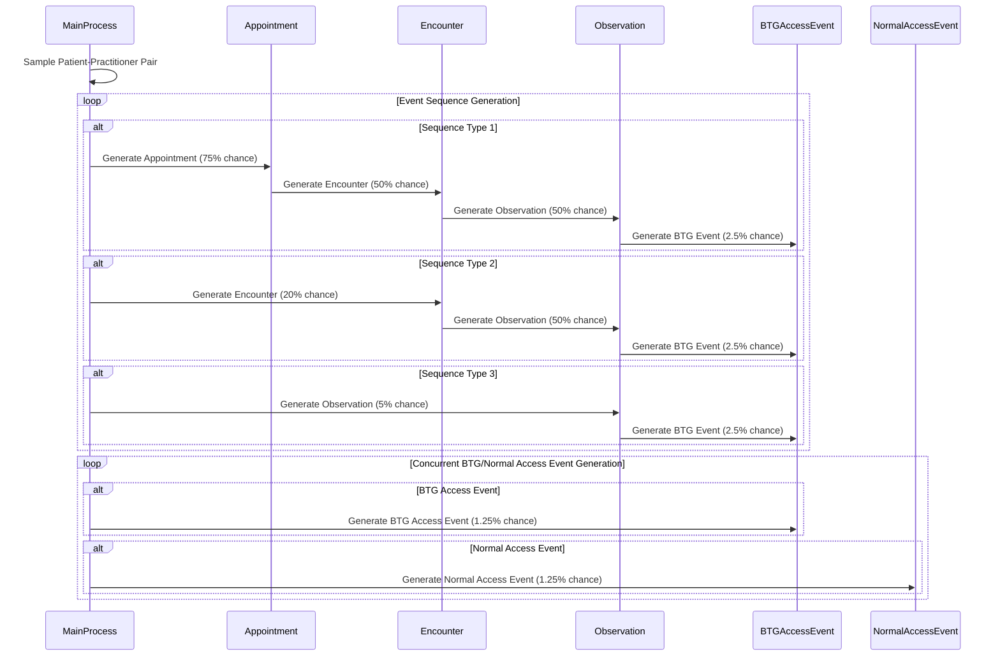

---
hide:
  - navigation
  - toc
---

# Simulation Details
 
The simulation generates synthetic interrelated [FHIR R5 resources](https://hl7.org/fhir/), including:

- [Practitioners](https://hl7.org/fhir/practitioner.html)
- [Patients](https://hl7.org/fhir/patient.html)
- [Appointments](https://hl7.org/fhir/appointment.html) (scheduled, cancelled, no-shows)
- [Encounters](https://www.hl7.org/fhir/encounter.html) (actual face-to-face visits between a patient and practitioner)
- [Observations](https://hl7.org/fhir/observation.html) (made by practitioners)
- [AuditEvents](https://www.hl7.org/fhir/auditevent.html), particularly [Break The Glass (BTG) emergency access events](https://terminology.hl7.org/5.2.0/CodeSystem-v3-ActReason.html#v3-ActReason-BTG)

## Implementation Details

The discrete-event simulation is implemented in [SimPy](https://simpy.readthedocs.io/en/latest/). An SQLite database is used to log events and manage practitioner and patient data. The data export script (`data_export.py`), located in  in the code repository, allows exporting the data saved in the SQLite database as serialized FHIR resources (JSON) or in a custom simplified format (JSON).

## Simulation Objective

The implemented discrete-event simulation aims to produce realistic event sequences that can be classified as either normal or anomalous patterns of healthcare system usage. It aligns with the **confidentiality scenario** described by McGlade and Scott-Hayward (2019)[^1], where various event sequences are generated to mimic normal and anomalous usage patterns.

In this context, 'access' events by clinician users against patients can be defined, within a 24-hour period, as anomalous when a user accesses a patient record without a legitimate relationship to the patient and without a 'break-glass' event. A relationship is defined by the presence or absence of appointments, observations, or encounters linking the patient and the clinician user. A 'break-glass' event is when a clinician legitimately accesses a patient record in an emergency situation.

## Classification Table

When event sequences are aggregated on a 24-hour basis, they can be classified according to the following classification table, as specified by McGlade and Scott-Hayward (2019)[^1]:

| ID  | Appointments | Observations | Encounters | Break-Glass | Class   | Description                                                                                         |
| --- | :----------: | :----------: | :--------: | :---------: | ------- | --------------------------------------------------------------------------------------------------- |
| 1   |      ❌      |      ❌      |     ❌     |     ❌      | Anomaly | No relationship between clinician and patient, no emergency access.                                 |
| 2   |      ❌      |      ❌      |     ❌     |     ✅      | Normal  | Emergency 'break-glass' event occurred.                                                              |
| 3   |      ❌      |      ❌      |     ✅     |     ❌      | Anomaly | Clinician met patient, no future appointment, no emergency access.                                   |
| 4   |      ❌      |      ❌      |     ✅     |     ✅      | Normal  | Emergency access to patient records during an encounter.                                              |
| 5   |      ❌      |      ✅      |     ❌     |     ❌      | Anomaly | Clinician observed patient, no future appointment, no emergency access.                              |
| 6   |      ❌      |      ✅      |     ❌     |     ✅      | Normal  | Emergency 'break-glass' event occurred during an observation.                                         |
| 7   |      ❌      |      ✅      |     ✅     |     ❌      | Anomaly | Clinician met and observed patient, no future appointment, no emergency access.                       |
| 8   |      ❌      |      ✅      |     ✅     |     ✅      | Normal  | Emergency access to patient records during an encounter and observation.                               |
| 9   |      ✅      |      ❌      |     ❌     |     ❌      | Normal  | Future appointment exists, no emergency access.                                                      |
| 10  |      ✅      |      ❌      |     ❌     |     ✅      | Anomaly | Future appointment exists, but emergency 'break-glass' event occurred.                                |
| 11  |      ✅      |      ❌      |     ✅     |     ❌      | Normal  | Clinician met patient, future appointments exist, no emergency access.                                |
| 12  |      ✅      |      ❌      |     ✅     |     ✅      | Normal  | Emergency access to patient records during an encounter, future appointments exist.                    |
| 13  |      ✅      |      ✅      |     ❌     |     ❌      | Normal  | Clinician observed patient, future appointments exist, no emergency access.                           |
| 14  |      ✅      |      ✅      |     ❌     |     ✅      | Normal  | Emergency access to patient records during an observation, future appointments exist.                  |
| 15  |      ✅      |      ✅      |     ✅     |     ❌      | Normal  | Normal hospital visit, no emergency access.                                                            |
| 16  |      ✅      |      ✅      |     ✅     |     ✅      | Normal  | Emergency access to patient records during an encounter and observation, future appointments exist.     |

## Simulation Assumptions

The discrete-event simulation is based on several key assumptions to ensure it, it produces realistic event sequences. The table below summarizes these assumptions:

| Assumption                          | Description |
|:------------------------------------|:------------|
| **Discrete Time Units**             | The simulation operates in discrete time units (minutes). |
| **Practitioner Availability**       | Practitioners have predefined work schedules (full-time, evening-shift, split-shift, part-time, weekend-only, and rotating 8`-hour shifts) to ensure the simulation mimics real-world constraints and availability of healthcare practitioners. |
| **Event Probabilities**             | Events occur with predefined probabilities and the time between events occur based on predefined probability distributions. |
| **Patient Cooldown**                | Patients have a cooldown period between appointments to simulate realistic scheduling and prevent unrealistic frequent appointments. |
| **Dynamic Patient Population**      | The simulation dynamically adjusts the patient population based on discharge and new patient addition probabilities. |
| **Sequence Generation of Events**   | The simulation can singleton events or generate sequences of appointments, encounters, and observations:  - **Appointments**: Can be scheduled, cancelled, or result in no-shows.  - **Encounters**: Occur as actual visits and can follow appointments.  - **Observations**: Made by practitioners and can occur during encounters. |
| **Random BTG/Normal Access Events** | The simulation can generate random Break The Glass (BTG) or normal access events at any time:  - **BTG Events**: Occur with a predefined probability and represent emergency access to patient records.  - **Normal Access Events**: Occur as part of regular scheduled interactions. |

### Event Transition Diagram

The following sequence diagram illustrates the (high-level) event generation process in the discrete-event simulation. It shows how different types of events (appointments, encounters, observations, and Break The Glass (BTG) events) are generated, along with their respective probabilities. The diagram also highlights the concurrent generation of BTG and normal access events, which can occur independently of the main event sequences.

[^1]: McGlade, D., & Scott-Hayward, S. (2019). ML-based cyber incident detection for Electronic Medical Record (EMR) systems. Smart Health, 12, 3–23. [doi:10.1016/j.smhl.2018.05.001](https://doi.org/10.1016/j.smhl.2018.05.001)